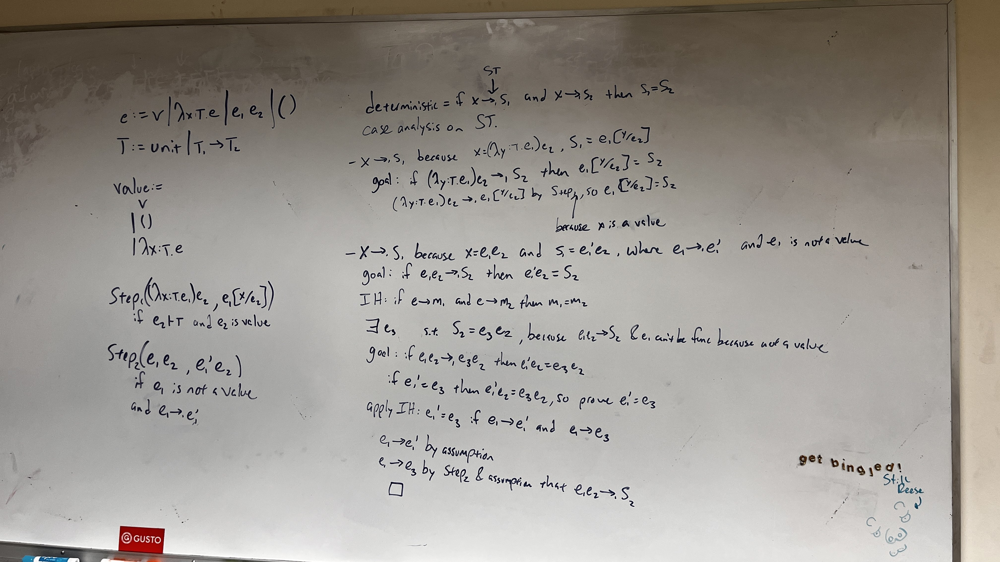

# determinism

Write a formal proof that the small-step operational semantics for simply-typed lambda calculus (STLC) is deterministic.

- Assume call-by-value semantics
- "Deterministic" means that if a program at state `X` can step into state `Y1`, and it can step into state `Y2`, 
  then it must be that `Y1 = Y2`. For example,
  
  `X = (lambda x:Nat. x + 3) 5`

  It is clear that `X` can only step to the state `5 + 3` after beta-reduction.
  If you had assumed that `X` stepped to some arbitrary state `Y1`, or to another arbitrary state `Y2`, 
  it is necessary that `Y1 = Y2 = 5 + 3`.
- Submissions deemed to be the output of a large language model will result in all further submissions for this challenge being ignored

Submit at /submit, check your grade at /flag

# Solution

texsaw{bruhproofughthatssohardomg}

# GRADING

- Need to spin up the docker container in texsaw25grading (docker build -t grading . && docker run -p 5000:5000 grading)
- Give each team a unique token, send it to /register as a JSON via POST: `{"key": "blah", "name": "blah"}`
- Only latest submission is stored so spamming is not an issue
- If deemed correct, they go to /flag and enter their token to see their feedback or the flag

