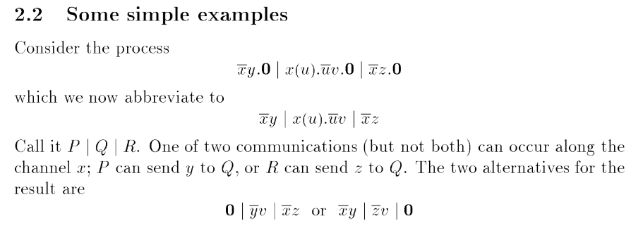

# nondeterminism

Write a formal proof that the [polyadic pi-calculus [Milner, 1991]](https://era.ed.ac.uk/handle/1842/6050) is non-deterministic.

A semantics is non-deterministic if a state `X` can step to at least two distinct states `Y1` and `Y2`.

- Submissions deemed to be the output of a large language model will result in all further submissions for this challenge being ignored.

# Solution

texsaw{omgeasyproof?didyouseepage2aftertheintroduction?}

see [deterministic] repository for submission details
