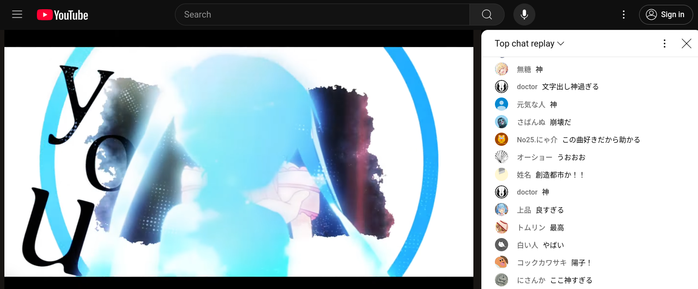

# tanpin

# Category

OSINT (medium)

# Author

caandt

# Description

I saved this screenshot of a video I liked, but I can't remember what it was!

All I remember is that the video was a collaboration (`合作`) and that it was uploaded sometime last September.

Can you find the following information about the image?

1. the YouTube video id of the collaboration (`v=???`)
2. the audio source (english song title, all lowercase)
3. the visual source (romanized name of the character in the image, all lowercase, given name then surname)
4. the YouTube channel of the author of the part shown in the image (`@???`, note that this is not the channel that uploaded the full video!)

Flag format: `texsaw{1,2,3,4}`

If the image was this:

then the flag would be: `texsaw{dQw4w9WgXcQ,never gonna give you up,rick astley,RickAstleyYT}`

# Flag

`texsaw{pxyONEf8ZGE,ice drop,aya komichi,ねそ-l9b}`

# Solution

1. Use the date search operators to find video candidates (`合作 after:2024-8-31 before:2024-10-1`), ignore videos that do not have a chat replay, and it should be near the top
2. Use an OCR tool to copy one of the chat messages from the image (or just be able to read Japanese)
3. Use a [chat downloader](https://github.com/xenova/chat-downloader) to download the chats of the videos returned from the search
4. `grep` for the specific chat message to find the correct video and timestamp
5. Use OCR on the song lyrics and search for them to find the song (or you can find it in the description of `7`)
6. Reverse image search a frame that clearly shows the character's face to find their name
7. Search the video title on YouTube to find a playlist of individual parts and skim through the thumbnails to find the part author's channel
